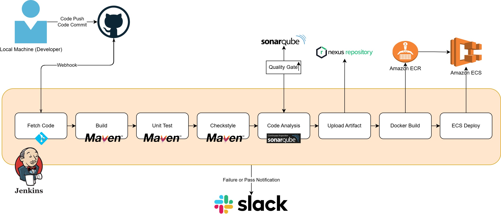
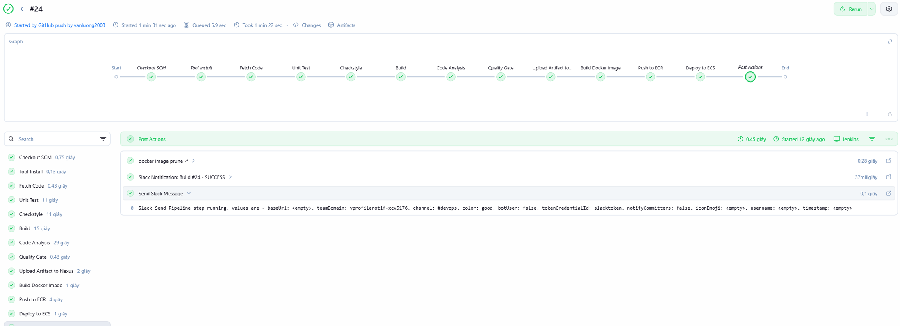
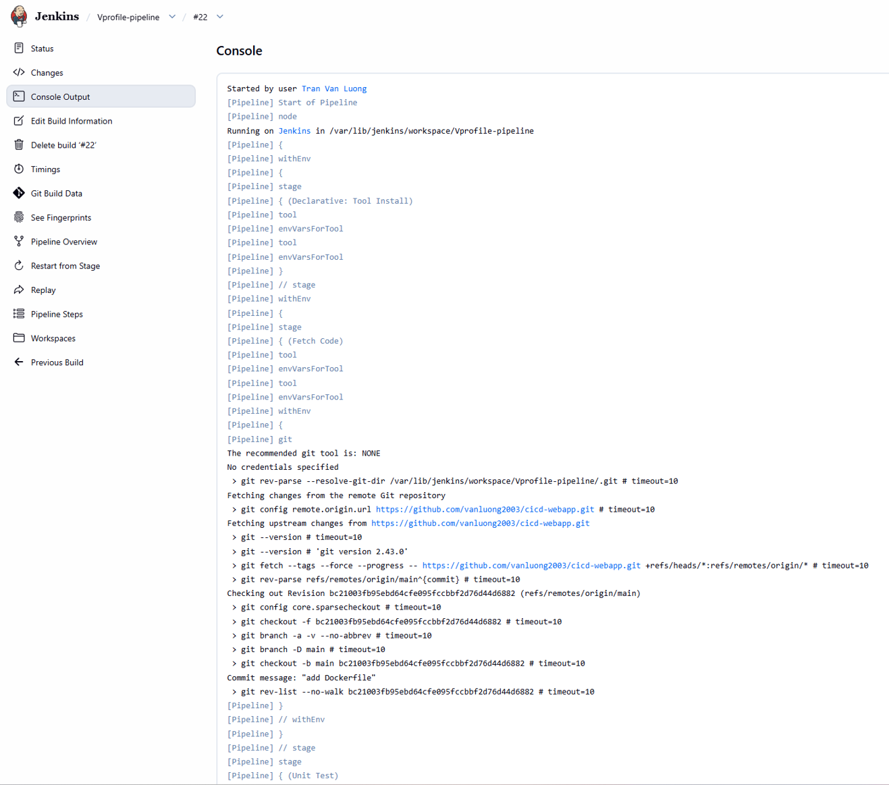
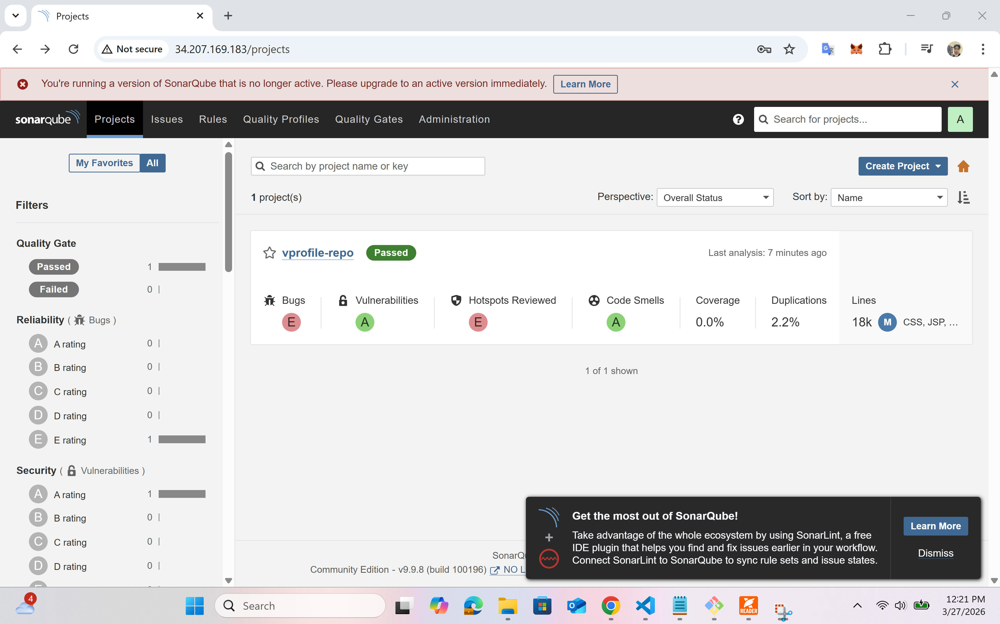
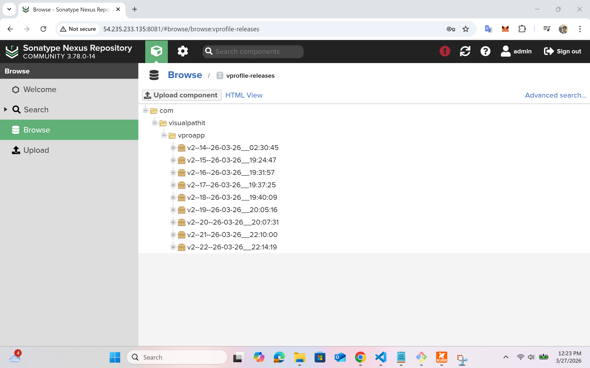
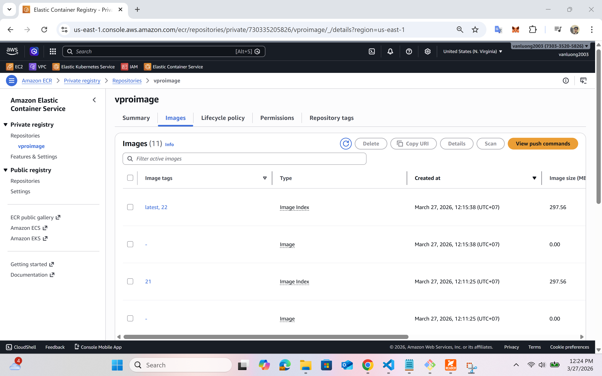
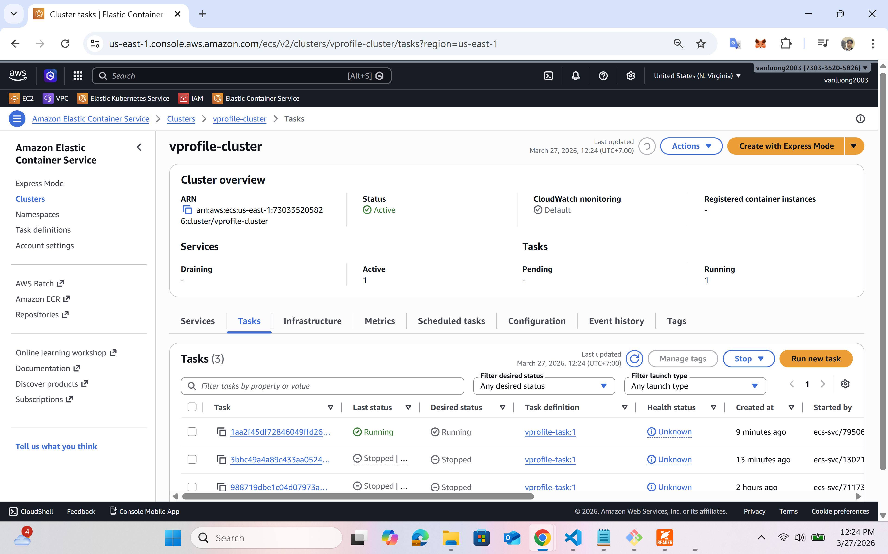
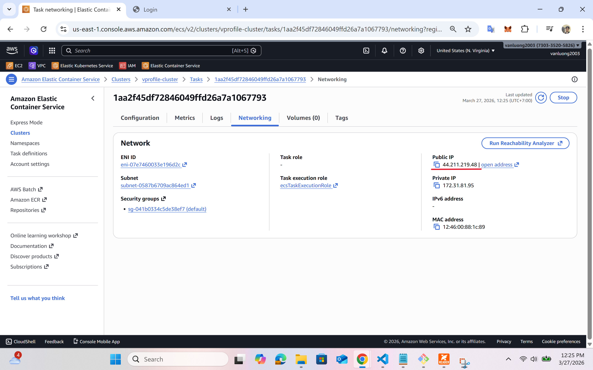
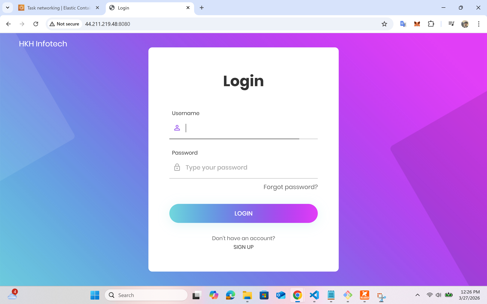
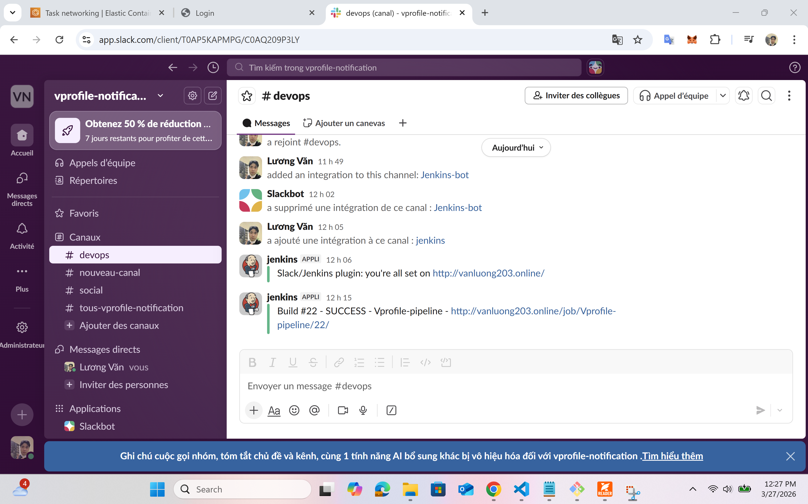

# CI/CD Pipeline with Jenkins, SonarQube, Nexus, Docker, Amazon ECR, Amazon ECS

## Project Overview
The project demonstrates a production-like CI/CD pipeline that automates the process of building, testing, analyzing, packaging, and deploying an application to AWS ECS.

### Tech Stack
- Jenkins (CI//CD)
- Maven (Build & Test)
- SonarQube (Code Quality)
- Nexus (Artifact Repository)
- Docker (Containerization)
- AWS ECR (Image Registry)
- AWS ECS (Deployment)
- Slack (Notification)

## Architecture

## CI/CD Pipeline Flow
### Pipeline Steps
    1. Developer pushes code to Github
    2. GitHub webhook triggers Jenkins pipeline
    3. Jenkins performs:
        - Fetch source code
        - Build application using Maven
        - Run unit tests
        - Perform code style check (Checkstyle)
        - Analyze code with SonarQube
        - Upload artifact to Nexus
        - Build Docker Image
        - Push image to AWS ECR
        - Deploy to AWS ECS
    4. Send notification to Slack channel

## CI/CD Pipeline Demo 
### Pipeline Stage View

### Console Output

### SonarQube Dashboard

### Nexus Repository

### Docker image on ECR 

### ECS Service Running

## Application Running

## Slack Notification

## Key Features
- Automated CI/CD pipeline using Jenkins
- Integrated SonarQube Quality Gate
- Artifact versioning with Nexus
- Docker image build and push to AWS ECR
- Deployment to AWS ECS
- Slack notifications for real-time feedback